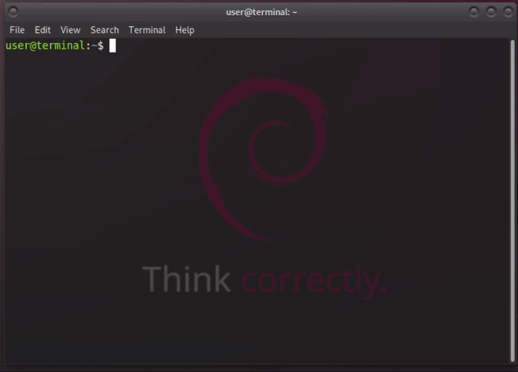

# liesel

Liesel turns ordinary PDFs into pamphlets/booklets which can be printed at home

This is **free software** (GNU GPL 3), and you are welcome to redistribute it under certain conditions.



## Features

*Note: Liesel is a* **command-line** *program. For a GUI front-end, see [BookThief](https://github.com/rail5/bookthief)*

Liesel will take any ordinary PDF (for example, an e-book) and combine/arrange the pages so that when the output PDF is printed, the entire stack of papers can just be folded in half to produce a booklet.


All listed features are optional. A simple command like *liesel -i somebook.pdf -o booklet.pdf* will of course work just fine

Liesel also comes with a *manual page* to help guide you through some more advanced options. You can view it, after installing Liesel, by running **man liesel** in your terminal


 - Range input (i.e, process only the specified pages) (Example: *-r 1-5,7-10,3,20,100-90*)

 - Segmented output (produce multiple PDFs in segments of any given length (e.g, 40 pages per segment), to be more manageable when printed) (Example: *-s 40*)
 
 - Color-to-grayscale conversion (*-g*)

 - Automatic "landscape"/"long-edge" flipping (*-l*)
 
 - Specify arbitrary PPI / quality (Example: *-d 175*)
 
 - Transform/resize output PDF to print on any given paper size (Example: *-t 8.5x11*)

 - Export preview before running command (Example: *-e 5,6 -o preview.jpeg*)

 - Crop PDF pages (Example: *-C 10,20,30,40* crops 10% from the left, 20% from the right, 30% from the top, 40% from the bottom)

 - Convert to pure black-and-white (Not grayscale) (Example: *-k 50* changes every pixel under 50% brightness to black, every pixel over 50% to white)

 - Widen center margins (add blank space between left and right-hand sides) (Example: *-w 20*)

 - Auto-widen center margins (*progressively* add blank space between left and right-hand sides, wider toward the middle of the booklet) (Example: *-a* or *-a 50*)

 - Divide each page into two pages (for example, if the PDF is a scanned book with left and right-hand pages not separated) (*-D*)

The manpage and *liesel -h* will provide a comprehensive list of options and how to use them


## Installation

64-bit .deb packages are provided in the "Releases" section


On Ubuntu-based distros, Liesel can be easily installed via the BookThief PPA:

```
sudo add-apt-repository ppa:rail5/bookthief
sudo apt-get update
sudo apt-get install liesel
```

## Build Requirements

- Magick++ API (Packages: **graphicsmagick-libmagick-dev-compat** & **libmagick++-6-headers**)

- libfontconfig1 (Package: **libfontconfig1-dev**)

- Poppler (Package: **libpoppler-cpp-dev**)

## Building

```
make
sudo make install
```

## Supported Systems

Liesel is currently tested & verified to successfully build & run on:

 - GNU/Linux
 - MacOS
 - OpenBSD*
 - Windows**

*On OpenBSD, 'gmake' (GNU make) must be used rather than the default 'make'. Run 'gmake openbsd'

**The Windows binaries must be compiled from GNU/Linux. Binaries for all other systems can be compiled from those systems themselves. See [autobuild](https://github.com/rail5/autobuild) for a script to automate the build process for GNU/Linux and Windows binaries

## Some small notes

To print like this, of course, the pages have to go in a certain order. That order is:

last-page + first-page, second-page + second-to-last-page, third-to-last-page + third page, etc.

So, with 12 pages, it would be: 12,1,2,11,10,3,4,9,8,5,6,7

One consequence of this is that the number of pages needs to be even -- further, it should even be divisible by 4 (*4 pages per sheet of paper*).

In the case that a given input is not even or not divisible by 4, say for example that you have 14 pages, Liesel will add 2 blanks to the end. If these blanks were not added, your printer would use 4 sheets of paper and leave the backside of the final sheet blank -- this would place 2 blank pages in the middle of your booklet when you fold it over. By shifting things around, Liesel places them at the end of your booklet instead, where they make more sense. Of course, if you supply an odd number of pages, which when incremented by 1 yield an even number divisible by 4, Liesel will only add 1 blank. Likewise, if you supply an odd number which must be incremented by 3, it will add 3 blanks.

If you're concerned that you might end up paying a lot of money for ink -- *ink* is dirt-cheap, the cartridges are what cost (it's a big scam). You can refill your own cartridges (and there are also printers sold which are designed to be refilled, if you do have the money for one).

I've personally home-printed somewhere around a dozen novels using Liesel at the time of writing (2021-12-02) and use Liesel to print the news almost every day, at virtually no cost, by just refilling my printer's ink cartridges. With all the money that used to go to public libraries now being moved to (insert **current** war here), this program serves pretty well
